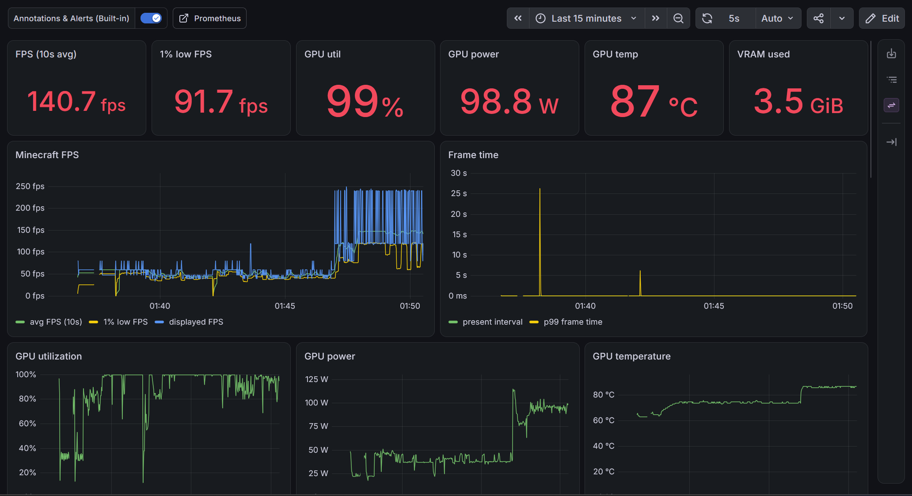
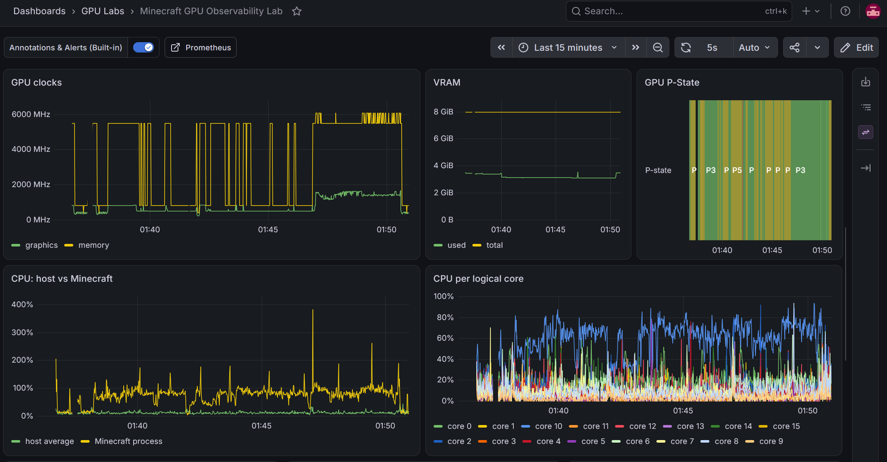
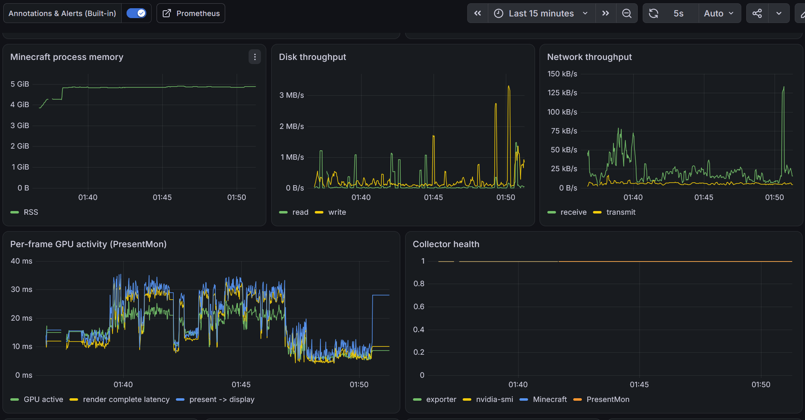
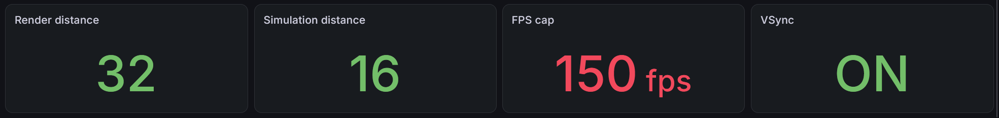
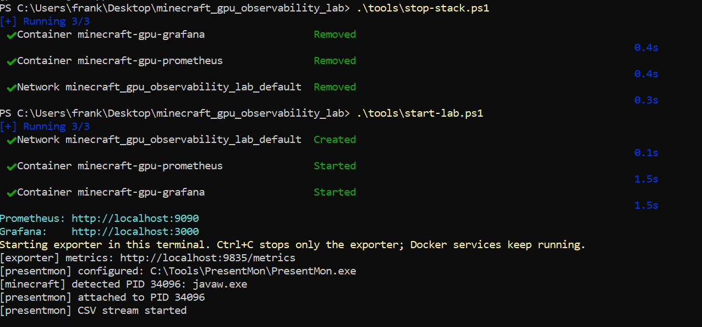
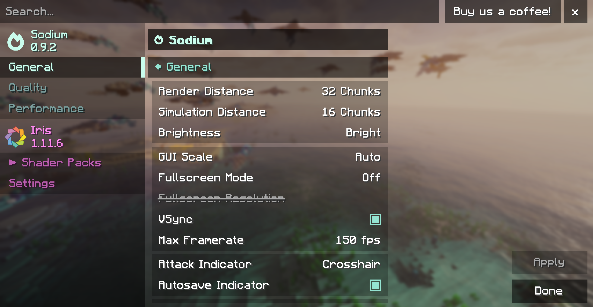
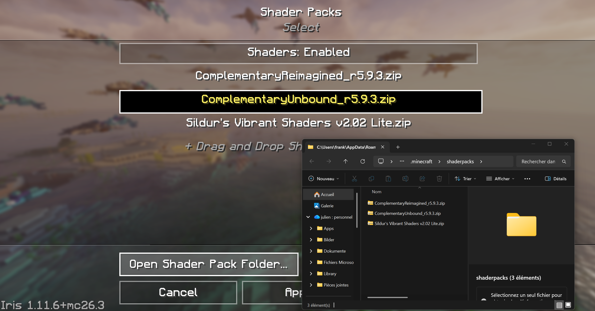
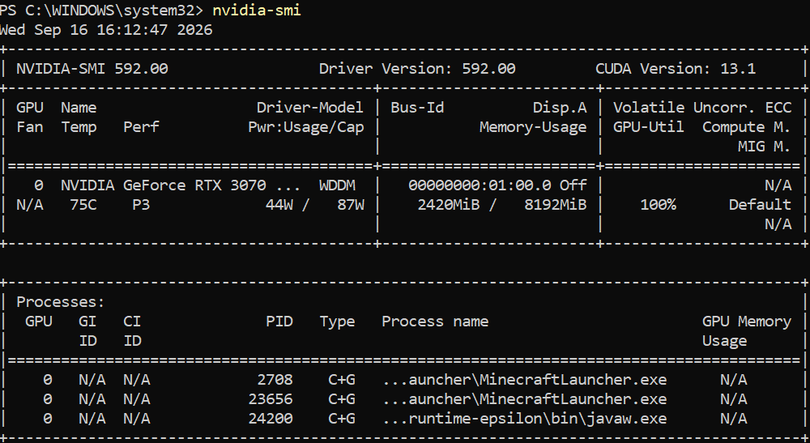
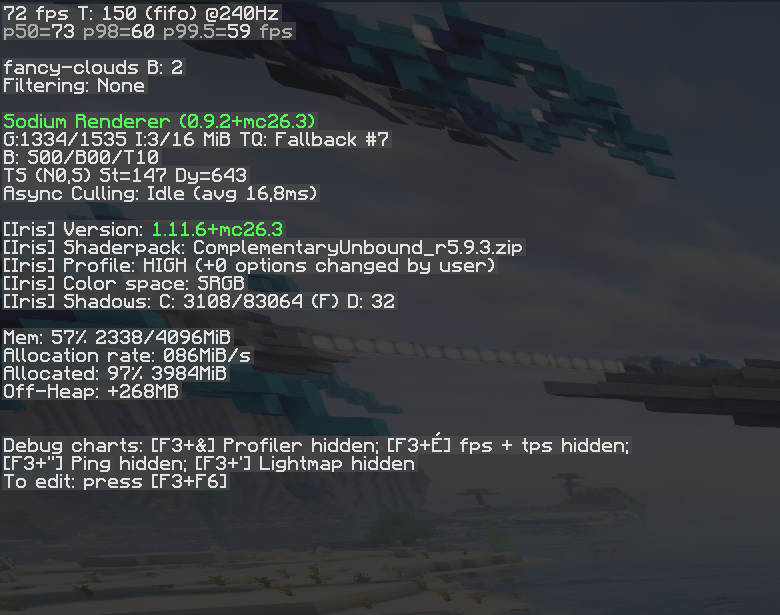
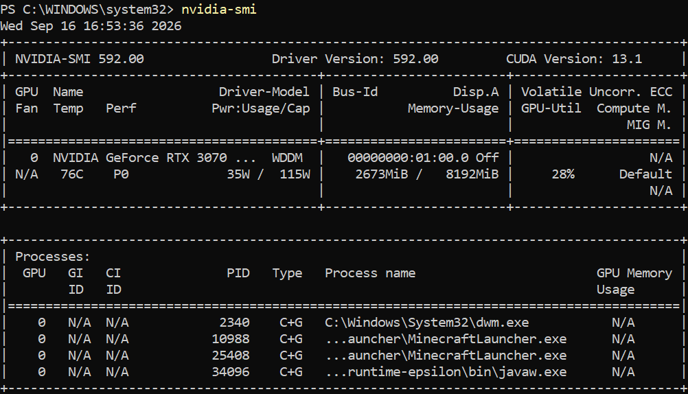

# Minecraft GPU Observability Lab

A small Windows lab that uses Minecraft as a real interactive workload and connects:

**Minecraft -> GPU/system telemetry -> Prometheus -> Grafana -> targeted Nsight Graphics investigation**

The goal is to practice a workflow that is useful in GPU infrastructure work:

1. formulate a question;
2. create a reproducible workload;
3. observe the system at coarse granularity;
4. correlate user-visible performance with GPU/CPU telemetry;
5. use a deeper profiler only when the coarse telemetry justifies it.

## Dashboard

Grafana is provisioned automatically with **Minecraft GPU Observability Lab**. Grafana is the main place to investigate a run. All panels share the same time axis so that a gameplay event can be compared with what the GPU, CPU and system were doing at that moment.

<p align="center">
  
</p>

<p align="center">
  
</p>

<p align="center">
  
</p>

<p align="center">
  
  <br>
  <em>Hypixel minigame session, played mostly in Silent mode before switching to Turbo near the end of the match.</em>
</p>

Most panels are self-explanatory, but a few are worth interpreting carefully.

**FPS, frame time and 1% low** describe what the player actually experiences. Average FPS is useful for overall throughput, while the 1% low helps expose short periods of poor frame pacing that can disappear inside a good average.

**GPU utilization, clocks, power and P-State** describe the operating state of the GPU, but none of them is a direct measure of how "full" the GPU is. They are useful mainly when read together. A GPU can, for example, report high utilization while operating under a restricted power profile, or produce more frames while an instantaneous utilization sample happens to be lower.

**PresentMon GPU-active time** adds another perspective by relating GPU activity to individual rendered frames rather than to a coarse driver sampling interval.

**Minecraft CPU and per-core CPU usage** are kept separately because total process utilization can hide a single latency-critical thread reaching its limit. Host CPU utilization also makes it possible to notice work outside Minecraft competing for CPU time.

**Disk and network throughput** are secondary diagnostic signals rather than gaming performance metrics. They become useful during scenarios such as fast Elytra flight, teleportation or dimension changes, where chunk loading or network activity may coincide with a visible hitch.

The dashboard also exports the current Minecraft render distance, simulation distance, FPS cap and VSync state from `options.txt`. These values provide context for the measurements without having to write every game setting down manually.

<details>
<summary><strong>Dashboard metrics</strong></summary>

- FPS / 1% low / displayed FPS
- frame time / p99
- GPU utilization
- GPU power and power limit
- GPU temperature
- graphics and memory clocks
- VRAM
- P-State timeline
- CPU host vs Minecraft
- CPU per logical core
- Minecraft memory
- disk throughput
- network throughput
- PresentMon per-frame GPU activity
- collector health
- current Minecraft render/simulation distance, FPS cap and VSync

</details>

Grafana annotations appear on the same timelines, so you can line up actions such as `Shaders ON`, `Teleport`, or `Nsight capture` with the telemetry response.


## Quick start

The lab has two parts:

- **Prometheus and Grafana** run through Docker Desktop.
- **The exporter and PresentMon** run directly on Windows, where they can access `nvidia-smi`, the Minecraft process and Windows frame telemetry.

### 1. Create the local configuration

From the repository root:

```powershell
Copy-Item .env.example .env
```

Then check `.env` before starting the lab.

In particular, do not forget to point the exporter to the PresentMon executable you installed:

```text
PRESENTMON_PATH=C:\Tools\PresentMon\PresentMon.exe
```

This is a value inside `.env`, not a PowerShell command. Change the path if `PresentMon.exe` is installed somewhere else.

### 2. Start Docker Desktop

Docker Desktop must be running in the background before the lab starts. Its window does not need to stay open.

A quick check is:

```powershell
docker info
```

If this command cannot reach the Docker daemon, `start-lab.ps1` will not be able to start Prometheus and Grafana.

### 3. Use a PowerShell session with the required PresentMon permissions

PresentMon creates an ETW tracing session on Windows.

If the current user does not have the required tracing permissions, PresentMon will start but fail with an error similar to:

```text
failed to start trace session: access denied
```

For the simplest local setup, run the lab from an **Administrator PowerShell**.

A cleaner permanent alternative is to add the Windows account to the **Performance Log Users** group.

If PresentMon starts behaving strangely after failed captures, repeated manual tests or an unclean shutdown, see [PresentMon / ETW troubleshooting](#presentmon--etw-troubleshooting).

### 4. Start the lab

```powershell
.\tools\start-lab.ps1
```

This starts Prometheus and Grafana, then keeps the Windows exporter running in the current terminal.

Minecraft may already be running, or it can be started afterwards. The exporter continuously looks for the Minecraft `javaw.exe` process.

A healthy startup should eventually look like:



```text
[exporter] metrics: http://localhost:9835/metrics
[presentmon] configured: C:\Tools\PresentMon\PresentMon.exe
[minecraft] detected PID ...: javaw.exe
[presentmon] attached to PID ...
[presentmon] CSV stream started
```

The last line is important: it confirms that PresentMon is not only running, but that frame data is actually reaching the exporter.

### 5. Open the interfaces

- Grafana: `http://localhost:3000`
- Prometheus: `http://localhost:9090`
- Raw exporter metrics: `http://localhost:9835/metrics` — the current Prometheus-formatted values exposed by the Windows exporter. Expect lines such as `gpu_lab_exporter_up 1`, `nvidia_smi_up{gpu="0"} 1`, `minecraft_process_up 1`, and, once PresentMon is streaming correctly, `minecraft_presentmon_up 1`.

Grafana credentials are defined in `.env`.

### Stopping the lab

Stop the exporter first:

```text
Ctrl+C
```

Then stop the Docker services:

```powershell
.\tools\stop-stack.ps1
```

Do not simply close or kill the exporter terminal while PresentMon is running. PresentMon owns an ETW tracing session, and an unclean shutdown can leave a process or trace session behind and make the next capture unnecessarily confusing.


## Experiments

The lab is designed around **controlled experiments**; Each experiment changes a limited number of variables and asks a specific diagnostic question. The goal is not simply to observe that FPS changed, but to correlate that change with GPU, CPU, memory, storage and frame-level behavior.

The initial experiment set covers:

- fast Elytra flight and chunk streaming;
- entity-heavy scenes;
- shaders OFF vs ON;
- render-distance scaling;
- teleportation and dimension transitions.

The complete questions I asked me are documented in [`docs/EXPERIMENTS.md`](docs/EXPERIMENTS.md).

## Further documentation

- [Experiments](docs/EXPERIMENTS.md) — experiment questions, run structure and annotation examples.
- [Profiling](docs/PROFILING.md) — PresentMon, Nsight and deeper GPU analysis.
- [Troubleshooting](docs/TROUBLESHOOTING.md) — Docker, exporter and PresentMon/ETW issues.

## Investigations 

### Shader off/on, both low FPS with some kind of blurring effect ; 

During GPU benchmarking, Minecraft initially showed unexpectedly poor and inconsistent performance when shader packs were enabled. The test system was an `ASUS ROG Zephyrus G15` equipped with a `Ryzen 9 6900HS` and an `NVIDIA GeForce RTX 3070 Ti Laptop GPU`. `Minecraft Java 26.3` was tested both in a completely vanilla configuration and through an `Iris/Sodium installation`. Iris was used only as the shader loader, while Sodium replaced parts of Minecraft's rendering implementation with a more optimized renderer. Shader packs themselves were installed separately and could be enabled or disabled from Iris without changing the Minecraft installation. This distinction was useful because it allowed three relevant configurations to be compared independently: vanilla Minecraft, Iris/Sodium with shaders disabled, and Iris/Sodium with a shader enabled.

<p align="center">
   Shader Menu" width="49%">
   Shader Menu > Add Shaders" width="49%">
  <br>
  <em>What the shader menus look like</em>
</p>

---

<p align="center">
  
  
  <em>Recorded for illustration; FPS measurements in minecraft were performed separately without screen recording (The record could affect real FPS)</em>
</p>


The first observations appeared to suggest that the shader workload was behaving abnormally. With a shader enabled and a large render distance, frame rates could fall to approximately 20–30 FPS at 32 chunks, roughly 25–35 FPS at 16 chunks, and approximately 50–60 FPS even after reducing both render and simulation distance to around 6 chunks. 

The first observations appeared to suggest that the shader workload was behaving abnormally. With a shader enabled and a large render distance, frame rates could fall to approximately 20–30 FPS at 32 chunks, roughly 25–35 FPS at 16 chunks, and approximately 50–60 FPS even after reducing both render and simulation distance to around 6 chunks. As visible in the screenshot above, the resulting motion was clearly not smooth, particularly during rapid camera movement. At that stage, however, the visual symptom was still ambiguous: The effect above can come from genuinely low frame rate, where the application is actually producing only ~27 frames per second, or from poor frame pacing / stutter, where the average FPS may be acceptable but individual frames arrive at irregular intervals. The FPS counter alone cannot distinguish those two cases reliably;  

One `nvidia-smi` sample (above) taken during this initial low-performance state made the situation even less obvious. At first glance, the low FPS suggested a GPU bottleneck, yet the GPU did not appear to be operating at its full capability: despite `GPU-Util = 100%` — meaning active throughout the sampling interval, not 100% of theoretical compute capacity — it remained in P3 and drew only around 44 W.

This raised the question of whether Minecraft was CPU-limited, power-limited, or affected by some external system-level constraint.

---

The CPU was investigated as a possible bottleneck because Minecraft Java does not scale every part of its workload uniformly across all available CPU cores. The Ryzen 9 6900HS provides 8 physical cores and 16 logical processors, but Minecraft consists of multiple threads with different responsibilities rather than one workload that can be distributed perfectly over all processors. Sodium itself uses worker threads for tasks such as chunk building and sorting. (https://github.com/CaffeineMC/sodium/blob/dev/common/src/main/resources/assets/sodium/lang/en_us.json)

This does not mean that Minecraft renders everything on one CPU core. Several parts of the renderer are parallelized, but some frame-critical operations still have ordering or synchronization constraints and remain dependent on the render thread before work can be submitted to the GPU. Recent Sodium development discussions explicitly describe command-buffer construction occurring on the render thread while other rendering work is handled asynchronously. (https://github.com/CaffeineMC/sodium/issues/3777

Consequently, low overall CPU utilization does not rule out a CPU-side bottleneck, since a single latency-critical thread can become saturated while most other cores remain lightly loaded. However, given the Ryzen 9 6900HS, such a severe CPU limitation was considered unlikely to be the primary cause of the observed 20–30 FPS.

---

Render distance was an obvious variable to test, and lowering it did improve frame rate substantially. However, performance still appeared unusually constrained even at much shorter distances, so render distance alone could not explain the original behavior.

Minecraft's render distance affects CPU-side world and chunk processing, while shader packs can additionally introduce rendering passes whose cost increases with the amount of geometry they process. A common example is the shadow pass (an additional rendering pass performed from the sun or moon's point of view). Iris documents this pass as rendering world geometry into dedicated shadow buffers before the main scene is rendered. (https://shaders.properties/current/reference/programs/shadow/)

The resulting shadow map (a depth representation of what the light source can see) is then sampled during normal rendering to determine whether a visible surface is exposed to the light source or occluded by other geometry. This is the standard shadow-mapping approach described in Iris's own shader documentation, rather than an assumption about the particular shader pack being tested. (https://shaders.properties/current/guides/your-first-shaderpack/4_shadows/)

The exact additional cost still depends on the shader pack, its shadow distance, resolution, culling behavior and other settings. The significant FPS improvement observed when reducing render distance was therefore expected, although it still did not explain why performance appeared unusually constrained at every tested distance.

---

Even completely vanilla Minecraft remained almost perfectly fixed at approximately 60 FPS, despite Minecraft's own maximum frame-rate setting being configured to 150 FPS and the game reporting a `240 Hz` display. The F3 overlay showed approximately `60 fps`, while also showing `T: 150` (T representing Minecraft's configured maximum frame-rate value), showing that the game was not actually reaching its own 150 FPS ceiling.

Iris/Sodium with shaders disabled behaved similarly. This strongly suggested that the 60 FPS ceiling was external to Minecraft itself.

Investigation of the Zephyrus laptop configuration then identified the system's operating profile as the cause. Testing of the same Zephyrus G15 generation documents the Silent profile using WhisperMode with a 60 FPS target and a substantially reduced GPU power budget compared with Turbo mode. (https://www.ultrabookreview.com/57620-asus-rog-zephyrus-g15-review-2/)

<p align="center">
  
  
  <br>
  <em>FPS and GPU: Turbo mode</em>
</p>

Switching the laptop to Turbo immediately changed the result: vanilla Minecraft rose to approximately 148 FPS, essentially reaching the configured 150 FPS ceiling, while the shader workload at 32 chunks increased to roughly 75 FPS instead of the previous 20–30 FPS range.

---

The Silent-to-Turbo comparison also exposed a subtler problem with interpreting the default nvidia-smi output. In Silent mode, one observation showed GPU-Util = 100%, P3 and approximately 44 W. After switching to Turbo and obtaining substantially higher frame rates, another instantaneous sample showed approximately 28% utilization, P0 and around 35 W. Taken literally, this appeared *paradoxical*: the system was delivering significantly more frames and visibly doing more useful work, yet the conventional utilization and power metrics could be lower at the instant they were sampled.

The important point is that **these metrics cannot be interpreted individually** as a measurement of total GPU workload. In particular, NVIDIA defines GPU-Util as activity over a sampling interval rather than as the percentage of theoretical GPU throughput being consumed. (https://docs.nvidia.com/deploy/nvidia-smi/) None of the values exposed by the default nvidia-smi view individually provides a scalar measurement of **"how full the GPU is."**

This led to an important distinction for the monitoring project between GPU activity, GPU throughput and the amount of rendering work actually requested.

---

Continuous telemetry is therefore preferable to isolated nvidia-smi snapshots. An instantaneous sample may capture only one moment of GPU behavior — or even a different workload state after Minecraft has lost focus — whereas continuous collection preserves the relationship between GPU behavior and what was happening in the game at that time. This provides a practical reason for keeping the metrics continuously available in Grafana.

PresentMon is particularly useful here because frame timing is available at the individual-frame level. At 25 FPS, a frame interval is approximately 40 ms; at 60 FPS, approximately 16.7 ms; and at 150 FPS, approximately 6.7 ms. More importantly, individual frames can vary substantially around that average. A nominally acceptable FPS value can therefore hide isolated long frames and visible stutter, which is precisely the kind of behavior that was initially observed during rapid camera movement. (https://github.com/GameTechDev/PresentMon/blob/main/README-CaptureApplication.md)

---

The experiment ultimately showed that the initial performance problem was dominated by an external laptop performance policy rather than by Minecraft, Iris or the hardware simply being incapable of the workload. Once the Zephyrus was switched from Silent to Turbo, vanilla Minecraft approached its configured 150 FPS cap and the shader workload at 32 chunks rose to roughly 75 FPS.

The investigation also revealed a second problem relevant to the monitoring project: conventional metrics such as GPU-Util, power, clocks and P-state do not directly quantify how much work the application is asking the GPU to perform. The next profiling stage therefore needs metrics that describe the workload itself or the throughput of the underlying GPU units more directly.

Three measurements are particularly interesting:

Executed shader instructions / thread-instructions — a useful proxy for the amount of shader computation executed. NVIDIA's Shader Profiler exposes both counters, although NVIDIA currently documents this profiler for D3D12 and Vulkan rather than OpenGL. (https://docs.nvidia.com/nsight-graphics/UserGuide/shader-profiler.html)
SM throughput / percentage of peak throughput — indicates how strongly the GPU's Streaming Multiprocessor pipelines are being exercised relative to their available throughput. NVIDIA GPU Trace exposes these throughput metrics and supports OpenGL. (https://docs.nvidia.com/nsight-graphics/UserGuide/gpu-trace-system-architecture.html)
GPU Busy per frame — already exposed by PresentMon, and useful for relating GPU execution time directly to individual rendered frames. (https://github.com/GameTechDev/PresentMon/blob/main/README-ConsoleApplication.md)

These measurements do not collapse GPU behavior into one universal percentage, but together they provide a much more meaningful description of workload demand than GPU-Util alone.

## Presentmon duplication 

During development, `PresentMon` initially worked correctly when launched manually against the Minecraft `javaw.exe` process. The first real failure was a permissions issue: when the exporter launched `PresentMon` from a non-elevated `PowerShell` session, `PresentMon` could start as a process but failed to create its ETW trace session with access denied. The exporter initially hid that error because `PresentMon`'s stderr was redirected to stdout and every line before the CSV header was silently ignored. After adding temporary logging, the permission error became visible. During further debugging, `PresentMon` was started and stopped many times both manually and by the exporter, using different ETW session names, and at one point two `PresentMon` processes were running simultaneously. One terminal was also closed abruptly because `Ctrl+C` could not be used conveniently from that elevated session. Normally, the exporter handles `Ctrl+C` by calling its `PresentMonReader.stop()` method, which terminates the `PresentMon` subprocess, waits for it, and kills it only if necessary. However, an abrupt termination of the Python process can bypass that cleanup path, so a `PresentMon` process or ETW tracing state may remain behind. The exporter also creates a dedicated session name (`MinecraftGpuLab_<PID>`) and uses `--stop_existing_session`, which helps avoid conflicts during normal operation. After the abrupt shutdown and repeated manual tests, `PresentMon` began reporting tens of thousands of lost ETW events and stopped producing CSV frames even when run independently of the exporter. Increasing the `PresentMon` circular buffer did not fix the issue. A full Windows restart reset the tracing environment; afterward, the same direct `PresentMon` command immediately produced frame data again, and the exporter successfully reported CSV stream started and `minecraft_presentmon_up = 1`. We cannot prove the exact internal ETW failure, but the observed evidence is consistent with a stale or conflicting tracing state created during debugging rather than a bug in the CSV parser itself.


A subtle cleanup bug was later identified in the exporter itself. The `KeyboardInterrupt` handler was placed inside the sampling loop, while the `time.sleep()` call occurred outside that try block. If `Ctrl+C` happened while the exporter was sleeping, Python raised `KeyboardInterrupt` from `time.sleep()` and completely bypassed the handler that called `presentmon.stop()`. As a result, the Python exporter exited, but its `PresentMon` subprocess and associated ETW session could remain active. This explains why a subsequent exporter start could report that a `MinecraftGpuLab_<PID>` trace session was already running. The fix was to wrap the whole main loop in an outer `try/except/finally` and call `presentmon.stop()` from `finally`, ensuring cleanup whether interruption happens during sampling, during sleep, or because of another exit path.